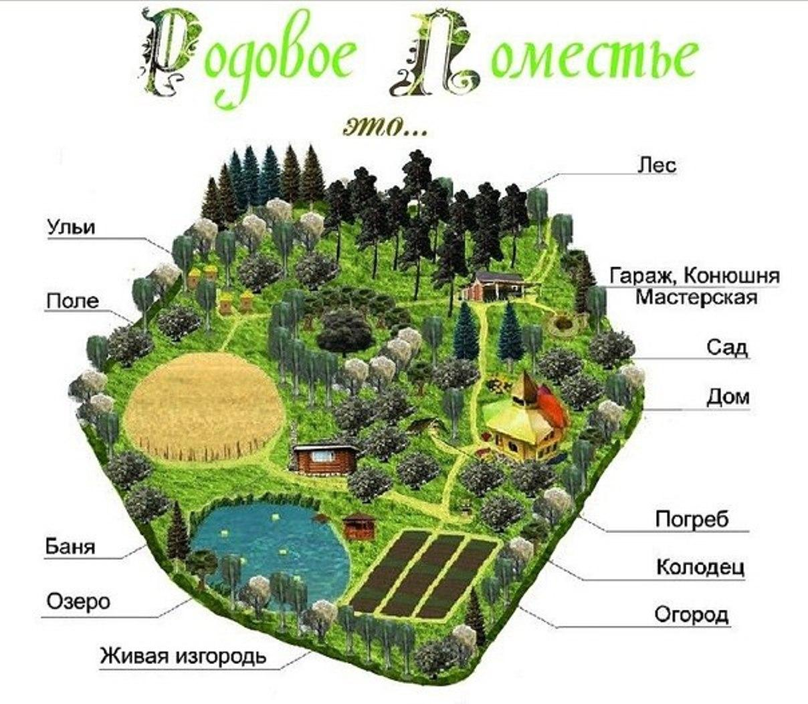

<u>Семья – это ценность.</u> Ведь любой здоровый человек хочет стать счастливым, встретить свою любовь, жениться или выйти замуж, родить и воспитать счастливых детей. Однако семья включает в себя не только мужа, жену и их детей. Это ещё бабушки и дедушки, прабабушки и прадедушки, другие прародители, а также их дети. Все они любят и оберегают своих близких, заботятся друг о друге.

Жизнь показывает, что самые счастливые семьи – это большие семьи, где родственники живут вместе или по соседству, помогают друг другу во всем, имеют общие шумные радостные праздники и будни, совместные дела и согласованные решения. Такие семьи дружно создают и заботятся о своей общей малой Родине – земле, обустроенной ими или же для них их предками, их Родом. Это та земля, которую мы называем Родовой, это то место, поместье, где живёт Род из поколения в поколение, с каждым годом всё больше облагораживая родную землю для своих потомков, наполняя его своей любовью и доброй памятью.

Мы желаем, чтобы у каждой белорусской семьи было своё Родовое поместье, с пышным плодовым садом  и пасекой, прудом и банькой, живой изгородью, огородом и даже собственным леском, домашними животными и птицами!

	

Мы считаем, что Родовое поместье лучше всего создавать на цельном, неделимом участке земли размером примерно 1 Га, чтобы оно было достаточно просторным и чтобы на нём можно было разместить все необходимые элементы для гармоничной жизни одной семьи. Обустроенное таким образом поместье сполна обеспечит семью и качественными продуктами питания, и чистым воздухом, и водой. А главное, подарит великолепные чувства сопричастности к формированию более совершенной среды обитания для детей.

Мы считаем, что думая о подрастающем поколении, жители Родовых поместий захотят видеть рядом с собой своих друзей и родственников, живущих в их собственных Родовых поместьях, все вместе они смогут сформировать новый тип населённого пункта – поселения, состоящего из Родовых поместий. В таком поселении понадобиться и школа, и клуб, и магазин, и общая территория, а также другие социальные объекты. Люди смогут самостоятельно продумать инфраструктуру и расположение социальных объектов в своём поселении, а возможно захотят воспользоваться типовыми проектами. Вот один из них:

Нам хочется верить, что жители поселений, состоящих из Родовых поместий, занимая активную жизненную позицию, будут самостоятельно решать множество вопросов обустройства и поддержания порядка в своих поселениях, формируя органы местного самоуправления. Но при этом поселения будут сотрудничать с органами местной государственной власти для решения более масштабных вопросов, требующих консолидированных действий. Например, заботясь об экологии или для реализации совместных проектов и праздников.

Мы рады отметить, что у современных создателей Родовых поместий уже сложились свои ценности:
	<ol>
		<li>Бережное отношение к природе</li>
		<li>Здоровый образ жизни</li>
		<li>Традиционные семейные ценности</li>
		<li>Любовь к Родине</li>
		<li>Активная жизненная позиция</li>
		<li>Стремление к устойчивому развитию территорий</li>
	</ol>

Мы считаем, что с такими ценностями, нашей стране обеспечено процветание и благополучие. Именно поэтому мы и предлагаем идею Родовых поместий в качестве Национальной идеи. Идеи, которая позволяет решить огромное количество вызовов, стоящих перед современным белорусским обществом, и одновременно обеспечить  национальную безопасность и устойчивое развитие нашей стране. О том, каким образом идея Родовых поместий позволяет этого достичь мы рассказываем в главе «Обоснование национальной идеи». Но для того, чтобы всё это осуществилось мы считаем необходимым принять на государственном уровне закон о Родовых поместьях, исходный текст которого мы подготовили и разместили на этом сайте.

Если идея Родовых поместий вам близка, то вы можете отдать свой голос в поддержку закона о Родовых поместьях и поселениях, проголосовав на нашем сайте здесь.

